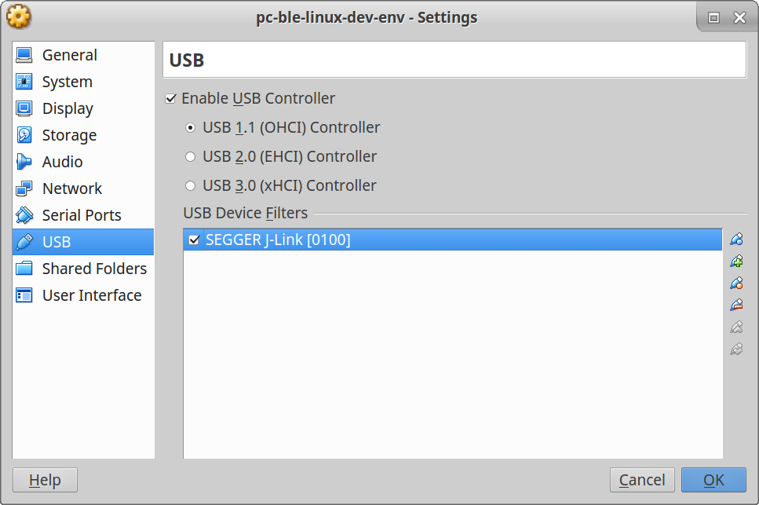

# Linux VM for working with pc-ble-driver

Sets up an Xubuntu 16.04 virtual machine with the toolchain required for
working with
[pc-ble-driver](https://github.com/NordicSemiconductor/pc-ble-driver) and
[pc-ble-driver-js](https://github.com/NordicSemiconductor/pc-ble-driver-js).

## Dependencies

- [Virtualbox](https://www.virtualbox.org/wiki/Downloads)
- [Vagrant](https://www.vagrantup.com/downloads.html)

## Usage

Clone this repo and run:

```
vagrant up
```

This will pull down an Xubuntu vagrant box and provision the VM. Wait for the
provisioning to finish before logging in with user **vagrant** and password
**vagrant**.

The Git repositories for pc-ble-driver and pc-ble-driver-js can be found in
/home/vagrant/repos.

## Keyboard configuration

If you have a non-English keyboard layout, you need to change the keyboard
configuration to make your keyboard work properly. After the VM has been set
up, type this in a terminal inside the VM and follow the instructions:

```
sudo dpkg-reconfigure keyboard-configuration
```

If you f.ex. have a Norwegian keyboard, choose "Generic 105-key" and then
"Norwegian".

## USB setup

To allow the VM to access your USB device, you need to enable the USB
controller in the Virtualbox settings.



Setup procedure:

1. If the VM is running, then shut it down first.
2. Insert the device into an USB port so that the host OS sees it.
3. Enable the USB controller in the Virtualbox settings, and add a device filter for SEGGER J-Link.
4. Start the VM.

### Note when running Linux as host OS

When running Linux as host OS, make sure that your user has been added to the
`vboxusers` group. If not, you will not see any devices in the USB device
filter screen in the Virtualbox settings. Use the following command to add your
user to the group:

```
sudo usermod -a -G vboxusers $USER
```

A re-login is required for this to take effect.

## Performance

By default, the VM is configured to use 1 CPU and 4 GB RAM. If you want to
allocate more/less resources to the VM, you can configure this in the
Virtualbox settings.

## Alternative distro

Feel free to use a different vagrant box if you want something else than
Xubuntu. [Find your desired box](https://atlas.hashicorp.com/boxes/search)
and change `config.vm.box` in the Vagrantfile.

You can f.ex. use `boxcutter/ubuntu1604-desktop` for a standard Ubuntu 16.04
desktop. Please note that the provisioning currently only supports
Debian-based distros.
